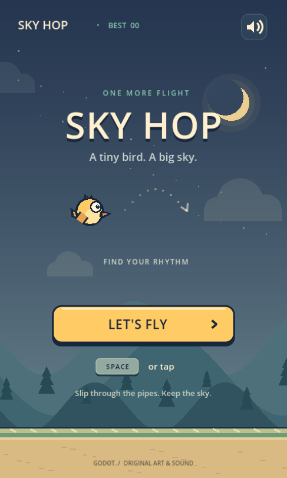

# Sky Hop · Godot Flappy Bird-style game

一个用 **Godot 4.6.3** 制作的完整 2D Flappy Bird 玩法复刻：轻点拍翅、穿越水管、挑战最高分。

Sky Hop has its own dusk-sky visual identity, code-drawn bird and scenery, and synthesized sound effects. It does **not** use the original Flappy Bird artwork, name as its title, or audio, and is not affiliated with its creator.



## Play / 运行

1. Install [Godot 4.6.3](https://godotengine.org/download/archive/4.6.3-stable/) (standard edition; no .NET required)
2. Clone this repository and import `project.godot`
3. Press **F6** on `main.tscn`, or **F5** to run the project

Command line:

```sh
godot --path .
```

| Input | Action |
| --- | --- |
| Space / Up / W / Enter | Start or flap |
| Left click / touch | Start or flap; buttons have their own actions |
| P / Esc | Pause / resume |
| Space / Enter while paused | Resume |
| R / Space / Enter after a crash | Retry after the short crash animation |
| M / speaker button | Toggle sound |

点击屏幕或空格开始并拍翅。P / Esc 暂停，失去窗口焦点自动暂停；回来后需要手动继续。碰到水管、地面或顶边即结束。

## Included

- Responsive 480 × 800 logical playfield with aspect-preserving letterboxing
- Gravity, upward impulses, circular bird collision and accurately matching pipe caps
- Bounded procedural pipe generation with gradual, capped difficulty
- Ready, playing, paused, crash and retry flows, including a restart cooldown
- Score, local personal best, medals and resilient local save data
- Mouse, keyboard and touch routing, key-repeat/multi-touch protection
- Parallax mountains, a crescent moon, vector bird animation, particles and four original synthesized effects
- A single-threaded Web / Compatibility export preset
- Deterministic automated mechanics/save tests and a separate input integration suite

No accounts, analytics, ads, network calls, paid dependencies or imported game assets are required. Scores remain on the player's device. Browser storage may be unavailable or cleared in private browsing; the game still plays and shows a storage notice when a write fails.

## Test

```sh
bash tests/run_tests.sh
bash tests/run_integration.sh
```

The test wrapper isolates test user data. See [tests/README.md](tests/README.md) and [docs/QA.md](docs/QA.md) for tested scope and explicit remaining limits. Tests intentionally pass malformed save content to Godot and label the expected parse diagnostic.

## Export to the Web

Install the **4.6.3 export templates** using Godot's Editor → Manage Export Templates. Engine and templates must match.

```sh
mkdir -p build/web
godot --headless --path . --export-release Web build/web/index.html
python3 -m http.server 8060 --directory build/web
```

Open `http://localhost:8060`. Use HTTP(S), not a `file://` URL. Keep the generated HTML, JS, WASM, PCK, worklets and images together. The preset uses WebGL 2 / Compatibility and disables threading, so it does not require cross-origin-isolation headers. Browser autoplay rules require a first tap/key press before audio can start.

A successful export is not proof of browser playability. The initial release's actual verification status is recorded in [docs/QA.md](docs/QA.md). No Pages deployment is configured by this project.

## Structure

```text
project.godot             Engine settings and viewport
main.tscn                 Main scene
scripts/flight_model.gd   Deterministic rules, generation and collision
scripts/game.gd           Rendering, input, UI and particles
scripts/save_store.gd     Score/settings persistence and validation
scripts/sound_bank.gd     Original procedural sound synthesis
assets/icon.svg          Original vector icon
tests/                   Reproducible regression tests
docs/                    Verification notes
```

## Art, credits and licensing

The game's vector artwork and sound synthesis were created for this project. Godot supplies its normal engine/default font resources. No third-party game art or audio is bundled. A distribution license for the project has not yet been selected; public source availability is not a grant of a separate open-source license. Godot itself retains [its own license](https://godotengine.org/license/).
